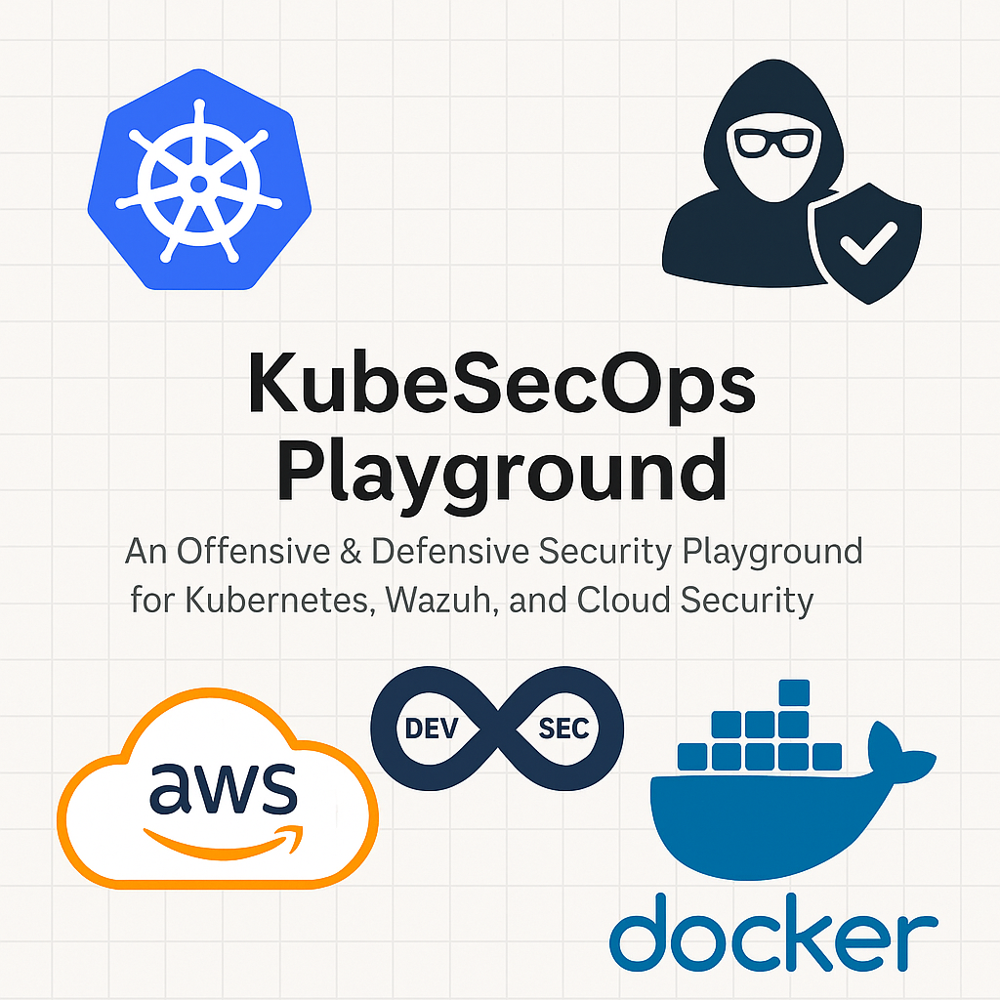

# KubeSecOps Playground

**An Offensive & Defensive Security Playground for Kubernetes, Wazuh, and Cloud Security**

  

---

## Project Overview

This is a self-directed project that blends offensive security with DevSecOps practices, focused around **Kubernetes**, **Wazuh SIEM**, and **cloud services (AWS/GCP)**.

### Current Goals

- Deepen Kubernetes security knowledge (RBAC, NetworkPolicy, PodSecurity, Runtime hardening).
- Integrate Wazuh for detection, alerting, and runtime log correlation.
- Simulate realistic offensive attacks and design defensive responses.
- Use scripting and automation with **Bash** and **Python**.
- Deploy on local and cloud.
- Document hands-on learning in a reproducible and extensible manner.

---
## License & Disclaimer

This project is licensed under the [MIT License](LICENSE).

> ⚠️ **Disclaimer:**  
> This project is intended **strictly for educational purposes**. It is designed to help security professionals, students, and enthusiasts understand offensive and defensive DevSecOps techniques in controlled, ethical environments.
>
> You are solely responsible for ensuring that any testing, simulation, or experimentation based on the contents of this project is conducted legally, ethically, and within authorized systems and networks.

---

## 🛠️ Tech Stack & Tools

| Tool / Tech           | Purpose                                         |
|-----------------------|-------------------------------------------------|
| Kubernetes            | Orchestration platform for container workloads |
| Wazuh                 | SIEM for monitoring, alerting, log ingestion   |
| Kustomize             | Declarative Kubernetes manifest management     |
| AWS/GCP               | Cloud IAM/networking exposure & threat modeling|
| Kubescape             | Security scanning and compliance               |
| Bash & Python         | Automation, scripting                          |
| GitHub Actions        | CI/CD and IaC validation pipelines             |
| Minikube              | Local Kubernetes cluster provisioning          |

---

### Prerequisites for Setup

- Docker knowledge
- `kubectl`
- `minikube`
- `kustomize`
- Python 3.x
- Git
- Basic understanding of Bash scripting

---
